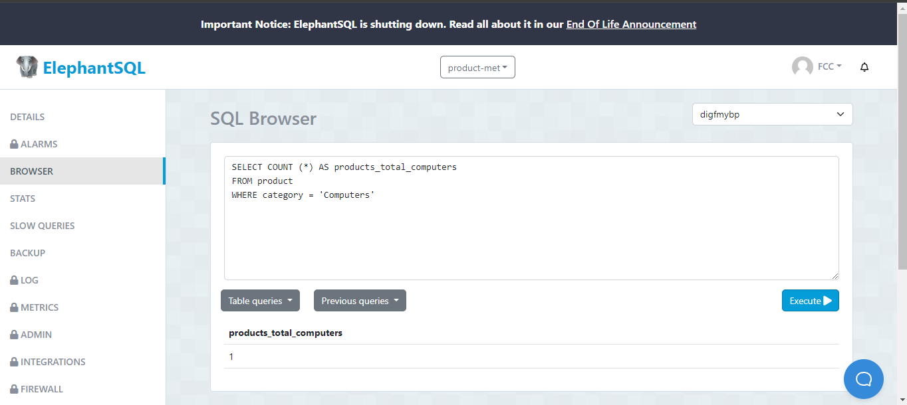
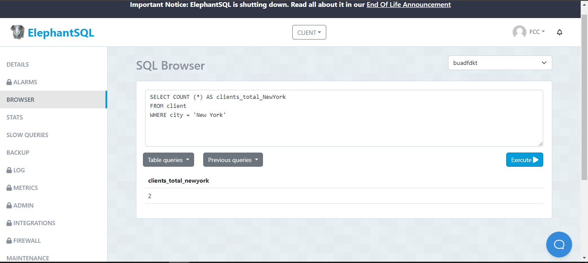
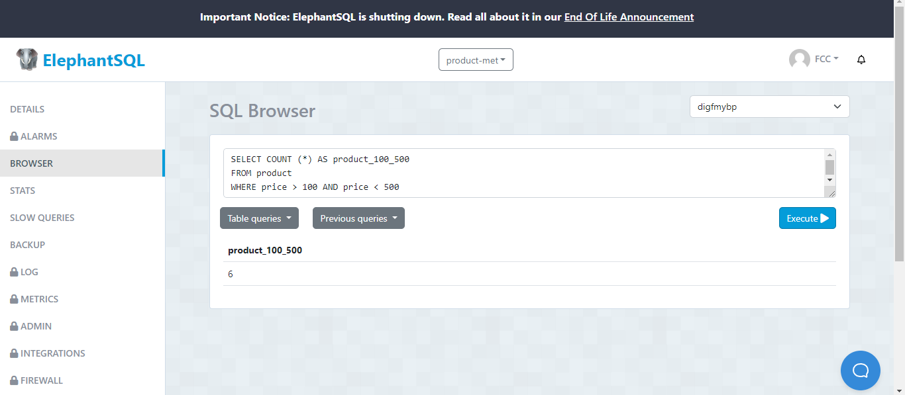
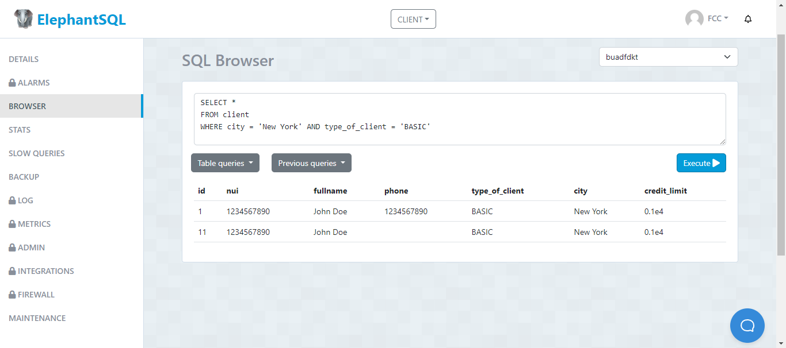
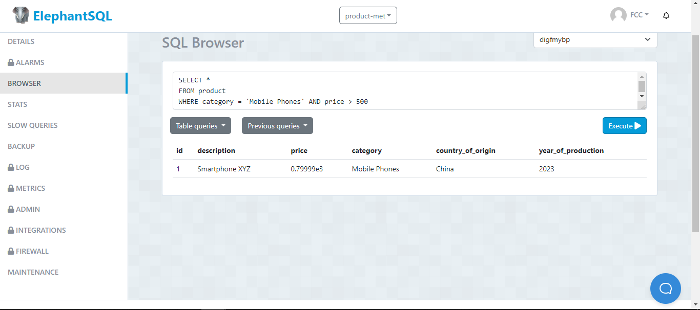

# TAS8 - Sentencias where multicriterio

## 1. Contar el número de productos de una categoría específica.
  - Sentencia:
  ```
SELECT COUNT (*) AS products_total_computers
FROM product
WHERE category = 'Computers'
  ```
  - Captura:


## 2. Contar el número de clientes en una ciudad específica.
  - Sentencia:
  ```
SELECT COUNT (*) AS clients_total_NewYork
FROM client
WHERE city = 'New York'
  ```
  - Captura:


## 3. Contar el número de productos cuyo precio está dentro de un rango específico 
  - Sentencia:
  ```
SELECT COUNT (*) AS product_100_500
FROM product
WHERE price > 100 AND price < 500
  ```
  - Captura:


## 4. Seleccionar clientes que viven en una ciudad específica y tienen un tipo de cliente específico
  - Sentencia:
  ```
SELECT *
FROM client
WHERE city = 'New York' AND type_of_client = 'BASIC'
  ```
  - Captura:


## 5. Seleccionar productos que pertenecen a una categoría específica y cuyo precio está por encima de un valor específico
  - Sentencia:
  ```
SELECT *
FROM client
WHERE city = 'New York' AND type_of_client = 'BASIC'
  ```
  - Captura:

